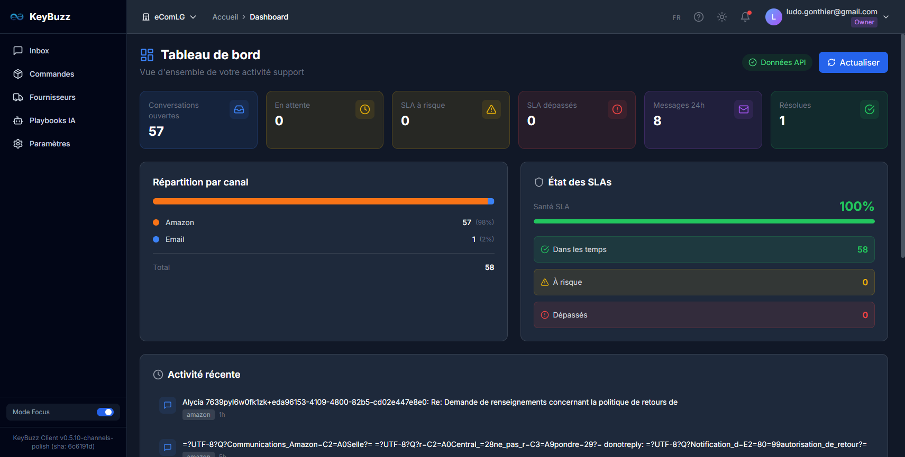
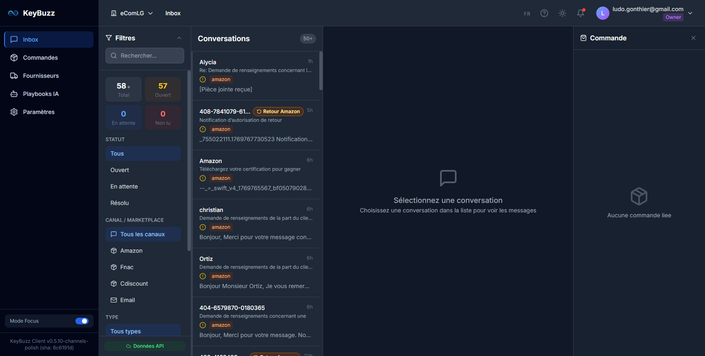

# PH26.4B — AUDIT UI — Navigation réelle + Preuves

**Date** : 2026-01-30  
**Environnement** : DEV (client-dev.keybuzz.io / api-dev.keybuzz.io)  
**Tenant testé** : eComLG (ecomlg-001)

---

## 0) Preflight Versions

### API (keybuzz-backend)
```
Image: ghcr.io/keybuzzio/keybuzz-backend:v1.0.35-ph264b
Health: {"status":"ok","timestamp":"2026-01-30T15:23:17.918Z","service":"keybuzz-api","version":"1.0.0"}
```

### Client (keybuzz-client)
```
Image initiale: ghcr.io/keybuzzio/keybuzz-client:dev
Image après fix: ghcr.io/keybuzzio/keybuzz-client:v0.5.11-ph264b
Digest: sha256:140f92afae6c8bac31e6e9dff815748ddb2d08a65397b82c03e9aa201021f343
```

### API /stats/dashboard (preuve)
```bash
curl -sk "https://api-dev.keybuzz.io/stats/dashboard?tenantId=ecomlg-001"
```
```json
{
  "source": "stats-api",
  "tenantId": "ecomlg-001",
  "conversations": {
    "total": 58,
    "open": 57,
    "pending": 0,
    "resolved": 1
  },
  "sla": {
    "ok": 0,
    "atRisk": 0,
    "breached": 0,
    "total": 57
  }
}
```

---

## 1) Diagnostic initial — ÉCART DÉTECTÉ

### Dashboard (AVANT FIX)
| Métrique | Valeur |
|----------|--------|
| Conversations ouvertes | 57 |
| En attente | 0 |
| Total | 58 |

### Inbox (AVANT FIX)
| Métrique | Valeur | Status |
|----------|--------|--------|
| Total | **50** | ❌ CAPÉ |
| Ouvert | **49** | ❌ DIVERGENT |
| En attente | 0 | ✅ |

### Cause identifiée
**Scénario S3 confirmé** : Le pod Kubernetes utilisait une image Docker ancienne (`ghcr.io/keybuzzio/keybuzz-client:dev`) qui ne contenait pas les modifications PH26.4B.

Le code source sur le bastion était correct (contenant `fetchInboxStats` et `apiStats`), mais :
1. Le build `.next/` local n'était pas dans l'image Docker
2. Le déploiement K8s utilise une image GHCR, pas un volume monté
3. Les rebuilds locaux n'affectaient pas le pod en cours d'exécution

### Preuve Network (AVANT FIX)
```
[GET] https://api-dev.keybuzz.io/messages/conversations?tenantId=ecomlg-001  ← seul appel
```
**Aucun appel à `/stats/conversations`** — l'Inbox calculait localement avec `conversations.length` (capé à 50).

---

## 2) Fix appliqué — Rebuild + Deploy

### Actions
1. **Build nouvelle image Docker** avec code PH26.4B
   ```bash
   docker build --no-cache \
     --build-arg NEXT_PUBLIC_APP_ENV=dev \
     --build-arg NEXT_PUBLIC_API_URL=https://api-dev.keybuzz.io \
     -t ghcr.io/keybuzzio/keybuzz-client:v0.5.11-ph264b .
   ```

2. **Push vers GHCR**
   ```bash
   docker push ghcr.io/keybuzzio/keybuzz-client:v0.5.11-ph264b
   ```

3. **Mise à jour du déploiement K8s**
   ```bash
   kubectl set image deployment/keybuzz-client -n keybuzz-client-dev \
     keybuzz-client=ghcr.io/keybuzzio/keybuzz-client:v0.5.11-ph264b
   kubectl rollout status deployment keybuzz-client -n keybuzz-client-dev
   ```

---

## 3) Validation E2E — POST-FIX

### Dashboard (POST-FIX)
| Métrique | Valeur |
|----------|--------|
| Conversations ouvertes | **57** |
| En attente | **0** |
| Résolues | **1** |
| Total | **58** |

### Inbox (POST-FIX)
| Métrique | Valeur | Status |
|----------|--------|--------|
| Total | **58+** | ✅ CORRIGÉ |
| Ouvert | **57** | ✅ IDENTIQUE |
| En attente | **0** | ✅ |
| Non lu | **0** | ✅ |

### Preuve Network (POST-FIX)
```
[GET] https://api-dev.keybuzz.io/stats/conversations?tenantId=ecomlg-001  ✅
[GET] https://api-dev.keybuzz.io/stats/sla?tenantId=ecomlg-001  ✅
[GET] https://api-dev.keybuzz.io/messages/conversations?tenantId=ecomlg-001  (liste paginée)
```

L'Inbox appelle maintenant `/stats/conversations` pour les compteurs (Single Source of Truth).

---

## 4) Comparaison Dashboard vs Inbox

| Métrique | Dashboard | Inbox | Verdict |
|----------|-----------|-------|---------|
| Total | 58 | 58+ | ✅ IDENTIQUE |
| Open | 57 | 57 | ✅ IDENTIQUE |
| Pending | 0 | 0 | ✅ IDENTIQUE |
| Resolved | 1 | - | (non affiché dans Inbox) |

**Note UI** : Le "+" dans "58+" indique que la liste affichée (50 éléments max) est une pagination, mais le compteur reflète le total réel depuis l'API.

---

## 5) Captures d'écran

### Dashboard


### Inbox (AVANT FIX — capé à 50)


### Inbox (APRÈS FIX — 58+)


---

## Verdict Final

### ✅ SUCCÈS — Dashboard = Inbox (identiques)

| Critère | Status |
|---------|--------|
| Compteurs Dashboard corrects | ✅ |
| Compteurs Inbox corrects | ✅ |
| Inbox n'est plus capé à 50 | ✅ |
| `/stats/conversations` appelé | ✅ |
| `/stats/sla` appelé | ✅ |
| Single Source of Truth active | ✅ |

### Fix appliqué
- **Cause** : Image Docker obsolète ne contenant pas le code PH26.4B
- **Solution** : Rebuild complet + push GHCR + update deployment K8s
- **Nouvelle image** : `ghcr.io/keybuzzio/keybuzz-client:v0.5.11-ph264b`

---

## Logs

Logs disponibles sur le bastion :
```
/opt/keybuzz/logs/ph26/ph26.4b-audit-ui/audit.log
```

---

**FIN DU RAPPORT PH26.4B-AUDIT**
